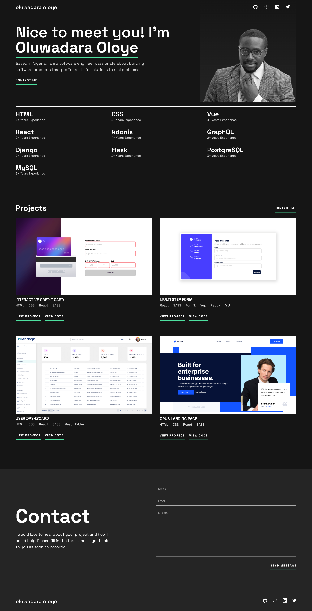
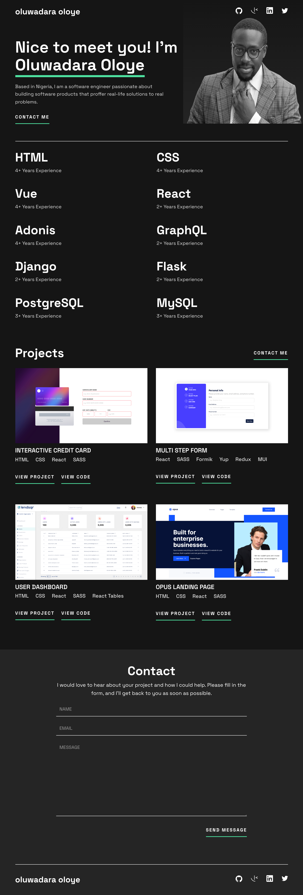

# My Portfolio Website

This is a solution to the [Single-page developer portfolio](https://www.frontendmentor.io/challenges/singlepage-developer-portfolio-bBVj2ZPi-x/hub). I seized the opportunity to create my own portfolio website.

## Table of contents

- [Overview](#overview)
  - [Screenshot](#screenshot)
  - [Links](#links)
- [My process](#my-process)
  - [Built with](#built-with)
  - [What I learned](#what-i-learned)
  - [Useful resources](#useful-resources)
- [Author](#author)

## Overview

This is a single page portfolio website that shows four of the top projects I have worked on till date, relevant links and details as well as a contact form where you can get in touch with me.

### Screenshot

### Links

- Solution URL: [Github Repository](https://github.com/OluwadaraDaily/my-portfolio)
- Live Site URL: [Add live site URL here](https://your-live-site-url.com)

## My process

I started work with the mobile section first. I divided up the page into sections and I built them in different `views`. As such, the logic, responsiveness and data for each section is separated from every one.
This is the first time I am trying this and seems to work well for a single page app.

### Built with

- Semantic HTML5 markup
- CSS custom properties
- Flexbox
- CSS Grid
- Mobile-first workflow
- [Vue3](https://vuejs.org/) - JS library
- [Vuelidate](https://vuelidate-next.netlify.app/) - A Vue Form Handler
- [Airtable API](https://airtable.com/developers/web) - Save form data submissions

### What I learned

I learned the following:

- Vuelidate. I learned how to use this library for this project.
- Vue3. I have used Vue2 for most of my life.

### Useful resources

- [Vuelidate](https://learnvue.co/articles/intro-to-vuelidate#using-vuelidate-with-the-composition-api) - This helped me to learn Vuelidate quickly.
- [Posting HTML form data to Airtable via REST API](https://blog.devgenius.io/html-form-to-airtable-via-api-fc2f6f743cef) - This helped me learn integrating with Airtable.

## Author

- Website - [Add your name here](https://www.your-site.com)
- Frontend Mentor - [@OluwadaraDaily](https://www.frontendmentor.io/profile/OluwadaraDaily)
- Twitter - [@OluwadaraDaily](https://www.twitter.com/OluwadaraDaily)